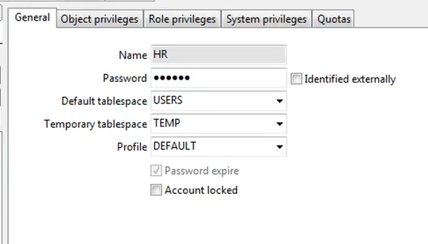
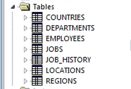

# SQL Structured Query Language

## SQL语言基础

### 什么是SQL

结构化查询语言(Structured Query Language)简称SQL(发音：sequal [‘si:kwəl])， 是一种数据库查询和程序设计语言，用于存取数据以及查询、更新和管理关系数库系统；同时也是数据库脚本文件的扩展名。

### SQL能做什么?

SQL面向数据库执行查 询
SQL可从数据库取回数据
SQL可在数据库中插入新的记录
SQL可更新数据库中的数据
SQL可从数据库删除记录
SQL可创建新数据库
SQL可在数据库中创建新表
SQL可在数据库中创建存储过程
SQL可在数据库中创建视图
SQL可以设置表、存储过程和视图的权限

### SQL 标准

SQL是1986年10月由美国国家标准局(ANSI)通过的数据库语言美国标准，接着，国际标准化组织(ISO)颁布了SQL正式国际标准。1989 年4月，ISO提出了具有完整性特征的SQL89标准，1992年11月又公布了SQL92标准，在此标准中，把数据库分为三个级别：基本集、标准集和完全集。在1999年推出99版标准。最新版本为SQL2016版。
比较有代表性的几个版本：SQL86、SQL92、 SQL99。
除了SQL标准之外，大部分SQL数据库程序都拥有它们自己的私有扩展

### SQL语言结构

#### 数据查询语言(DQL: Data Query Language)

其语句，也称为”数据检索语句“，用以从表中获得数据，确定数据怎样在应用程序给出。关键字SELECT是DQL(也是所有SQL)用得最多的动词，其他DQL常用的关键字有WHERE，ORDER BY，GROUP BY和HAVING。这些DQL关键字常与其他类型的SQL语句一起使用。
```sql
select ... from ... where ... 查询数据
```

#### 数据操作语言(DML: Data Manipulation Language)

其语句包括动词INSERT, UPDATE和DELETE。它们分别用于添加，修改和删除表中的行。

```sql
insert ... 插入一条数据
update ... 更新一条数据
delete ... 删除一条数据
```

#### 事务处理语言(TCL: Transaction Control Language)

它的语句能确保被DML语句影响的表的所有行及时得以更新。

```sql
commit ... 事物提交
rollback ... 事物回滚
savepoint ... 设置回滚点
```

#### 数据控制语言(DCL: Data Control Language)

它的语句通过GRANT或REVOKE获得许可，确定单个用户和用户组对数据库对象的
访问。

```sql
grant ... 授予用户权限
revork ... 撤销用户权限
```

#### 数据定义语言(DDL: Data Definition Language)

```sql
定义数据库对象语言，其语句包括动词CREATE和DROP等。
create ... 创建数据库对象
drop ... 删除数据库对象
alter ... 修改数据库对象
rename ... 修改数据库对象名称

```

## Oracle中的HR用户介绍

HR用户是Oracle自带的一个示例用户。在该用户下提供了可供我们练习数据库操作时所使用的表与数据。

### 使用HR用户步骤

1. 通过sys或system用户登录。

2. 在Users中找到HR用户并设置登录密码。

   

    

3. 切换HR用户登录

4. 查看该用户下的表结构

   

   